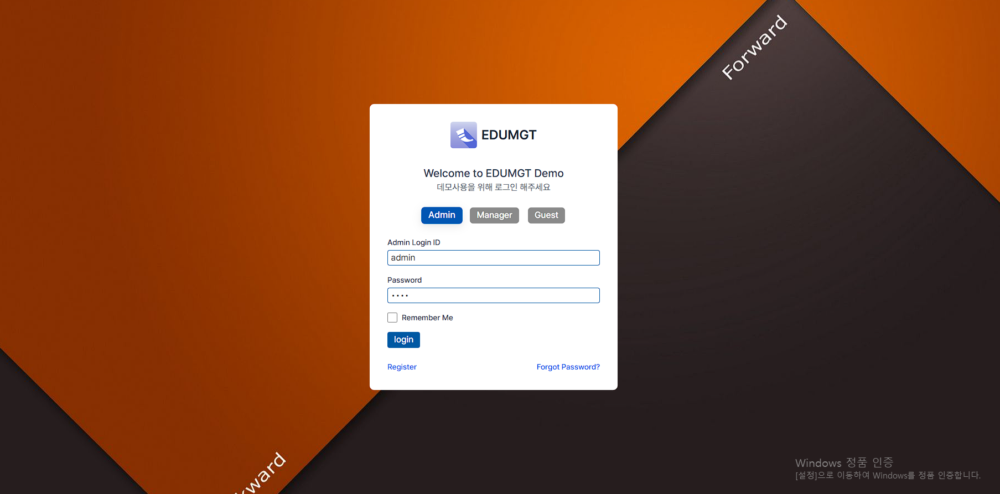
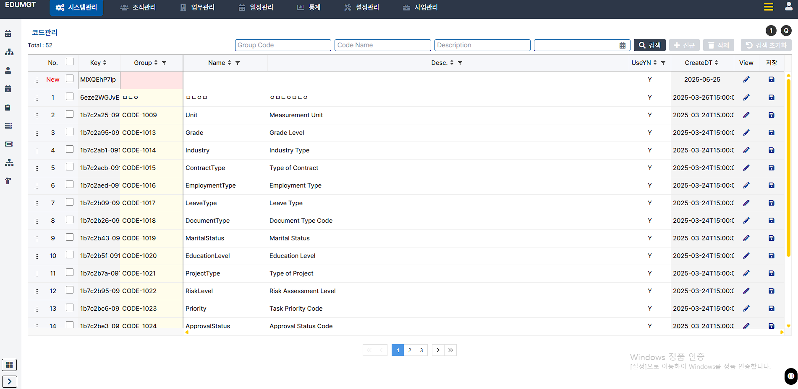
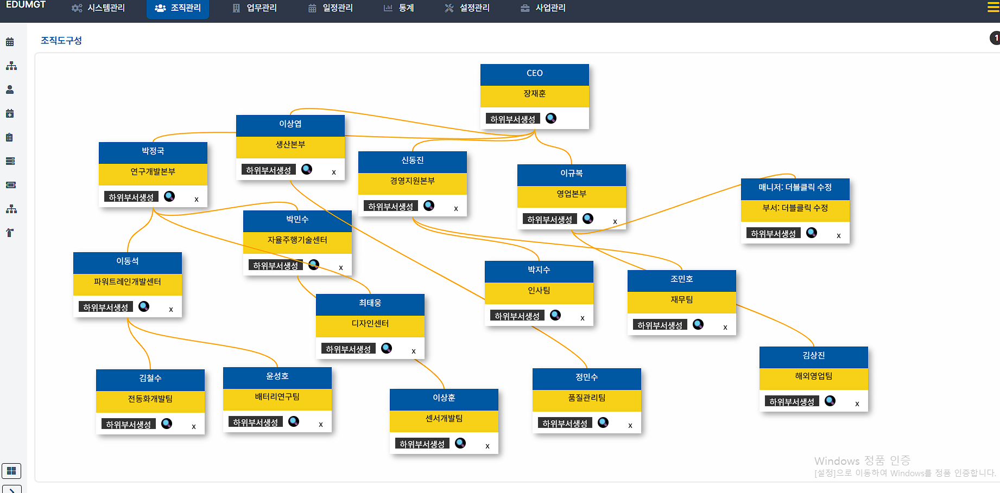
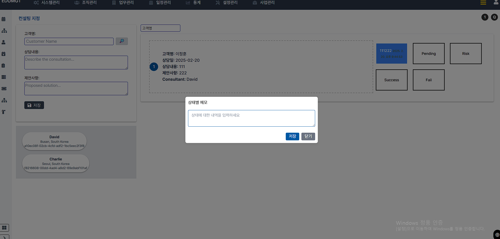
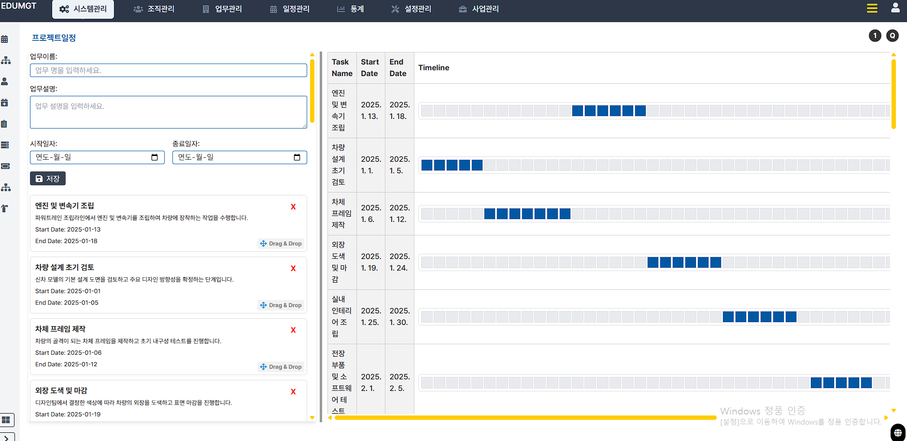
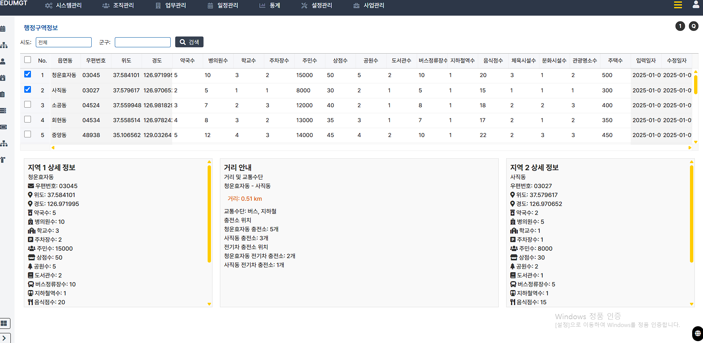
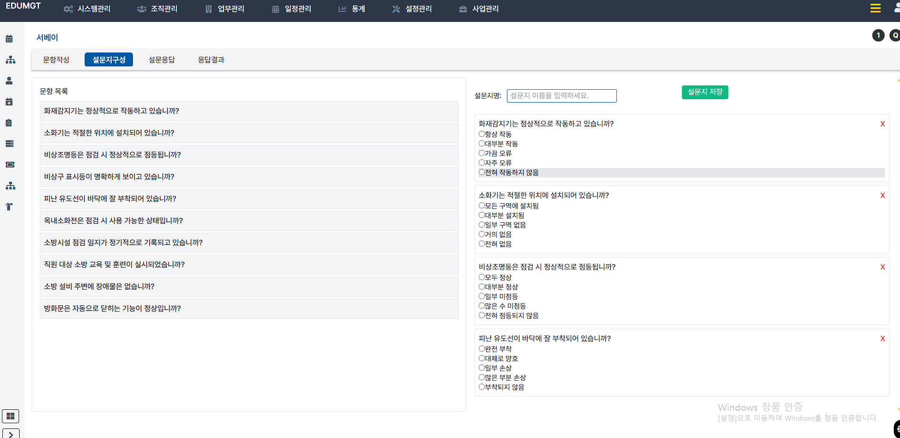

# Admin Vanilla Publishing

정적 HTML/Vanilla JS 화면과 `backend_fastapi` 기반 FastAPI 서버를 한 저장소에서 함께 운영하는 데모 리포입니다. 현재 수정 기준 백엔드는 `backend_fastapi/` 이고, `backend/` 는 legacy 참고 구현입니다.

## 빠른 실행

```bash
./run_backend.sh
```

실행 후 확인:

- 메인 화면: `http://localhost:8000/`
- PaaS 설치 콘솔: `http://localhost:8000/config.html`
- 블루마블 데모: `http://localhost:8000/burumable.html`
- 헬스체크: `http://localhost:8000/health`
- 준비상태 체크: `http://localhost:8000/health/ready`

개발/운영 모드:

```bash
# 개발 모드(default, reload on)
APP_ENV=development ./run_backend.sh

# 운영 모드(reload off)
APP_ENV=production ./run_backend.sh
```

## 저장소 아키텍처


핵심 구성:

- `run_backend.sh`: `.venv` 생성, 의존성 설치, `backend_fastapi/docker-compose.yml` 의 PostgreSQL 기동, readiness 확인 후 Uvicorn 실행
- `backend_fastapi/`: 로그인/JWT, 데모 API, SQLAlchemy 모델, `public/` 및 `/infra` 파일 서빙
- `public/`: HTML 화면, 공통 메뉴, JS/CSS 자산, SVG 아키텍처 이미지
- `infra/`: AWS 서버리스, 온프레미스 Docker Compose, 온프레미스 Kubernetes 배포 스캐폴드
- `scripts/`: AWS 부트스트랩 스크립트와 `capture-screens.js` 기반 화면 캡처 자동화
- `DOCS/`: README 에서 사용하는 화면 캡처 이미지 모음

실행 흐름:

1. `run_backend.sh` 가 루트 `.venv` 를 준비하고 FastAPI 의존성을 설치합니다.
2. 같은 스크립트가 `backend_fastapi/docker-compose.yml` 로 PostgreSQL 컨테이너를 먼저 띄웁니다.
3. DB readiness 확인이 끝나면 FastAPI가 `http://localhost:8000` 에서 실행됩니다.
4. 브라우저는 같은 오리진에서 정적 화면과 API를 함께 사용합니다.

## 주요 환경 변수

- `DATABASE_URL`
- `APP_ENV`
- `CORS_ALLOW_ORIGINS`
- `JWT_SECRET_KEY`
- `ACCESS_TOKEN_TTL_MINUTES`
- `REFRESH_TOKEN_TTL_MINUTES`
- `DEMO_AUTH_ENABLED`
- `DEMO_USERS_JSON`

샘플 값: [backend_fastapi/.env.example](./backend_fastapi/.env.example)

## API 와 화면 매핑

화면별 호출 API와 구현 여부는 [docs/api-mapping.md](./docs/api-mapping.md) 에 정리되어 있습니다.

## PaaS 설치 콘솔

- 설치 화면: `http://localhost:8000/config.html`
- 1차 선택: `AWS Cloud` 또는 `On Prem`
- 2차 선택: `On Prem` 선택 시 `Docker Compose` 또는 `Kubernetes`
- 선택 결과는 브라우저에 저장되며, 설정 JSON 다운로드와 스캐폴드 미리보기를 바로 제공합니다.

관련 스캐폴드:

- 공통 프로파일: [infra/setup.profile.example.json](./infra/setup.profile.example.json)
- AWS 서버리스: [infra/aws/README.md](./infra/aws/README.md)
- Docker 온프레미스: [infra/docker/README.md](./infra/docker/README.md)
- Kubernetes 온프레미스: [infra/k8s/README.md](./infra/k8s/README.md)

실행 중에는 `/infra/...` 경로로 브라우저에서 각 파일을 직접 열 수 있습니다.

## 배포 아키텍처

### AWS Cloud / Serverless + Steering

CloudFront + S3 로 정적 파일을 전달하고, API Gateway + Lambda 로 FastAPI 런타임을 노출하는 구성입니다. 필요 시 별도 EKS steering plane 을 붙일 수 있습니다.


### On Prem / Docker Compose

사내 단일 서버 또는 소규모 VM 기준으로 `nginx`, `backend_fastapi`, `postgres` 를 한 호스트에서 묶어 올리는 구성입니다.


### On Prem / Kubernetes

사내 Kubernetes 클러스터 기준으로 Ingress, frontend/backend Deployment, PostgreSQL StatefulSet 으로 나눈 구성입니다.


## DOCS 화면 갤러리

아래 이미지는 모두 `DOCS/` 원본을 README 에 그대로 붙인 것입니다. 화면 성격이 비슷한 것끼리 묶어서 설명을 추가했습니다.

### 1. 진입 화면과 공통 네비게이션

#### 로그인 화면 `public/index.html`

Admin, Manager, Guest 탭을 가진 기본 로그인 진입 화면입니다. 현재 데모 인증 흐름의 시작점입니다.



#### 코드관리 기본 화면 `public/system.html`

코드 그룹과 코드명을 테이블로 관리하는 대표 CRUD 화면입니다. 검색, 페이징, 저장 버튼 구성을 보여줍니다.



#### 다국어 전환 예시

같은 코드관리 화면을 일본어 라벨 기준으로 노출한 캡처입니다. 우하단 언어 선택 팝업까지 함께 보입니다.


#### 전체 메뉴 오버레이

상단 메뉴에서 진입 가능한 전체 기능 목록을 한 번에 보여주는 오버레이입니다. 화면별 HTML 엔트리와 메뉴 체계를 확인할 수 있습니다.


#### 좌측 트리 메뉴 전개 상태

좌측 LNB가 펼쳐진 상태의 코드관리 화면입니다. 공통 메뉴 모듈이 어떤 계층 구조로 화면을 묶는지 확인할 수 있습니다.


### 2. 조직, 일정, 운영 화면

#### 일정 상세 팝업 `public/calendar.html`

월간 일정 캘린더에서 특정 날짜의 업무를 수정하는 팝업 예시입니다. 날짜, 시간, 메모 입력 UI를 보여줍니다.


#### 조직도 구성 `public/orgni.html`

드래그 가능한 카드형 조직도 화면입니다. 부서/팀 계층과 연결선을 시각적으로 조정하는 흐름을 보여줍니다.



#### 컨설팅 지정 `public/network.html`

고객 상담 내용을 입력하고 프로세스 상태를 Pending, Success, Fail, Risk 로 분류하는 운영 화면입니다.



#### 프로젝트 일정 `public/trello.html`

업무 리스트와 간트 타임라인을 좌우로 배치한 프로젝트 일정 화면입니다. 좌측 등록, 우측 일정 시각화 구조가 한 번에 보입니다.



#### 행정구역 비교 `public/city.html`

행정구역 데이터를 표로 조회하고, 두 지역의 상세 정보와 거리/교통 정보를 비교하는 화면입니다.



#### 근태관리 `public/attend.html`

부서, 직원, 월 기준으로 출퇴근 기록을 가로 캘린더 형태로 보는 근태 관리 화면입니다.


### 3. 관리 도구와 업무 편집 화면

#### 권한관리 `public/orgtree.html`

좌측 조직 트리에서 부서를 선택하고 우측에서 기능별 권한 체크박스를 설정하는 화면입니다.


#### 설문지 구성 `public/survey.html`

설문 문항 목록을 왼쪽에서 고르고, 오른쪽에서 설문 제목과 문항 배치를 구성하는 빌더 화면입니다.



#### 설문 응답 결과 `public/survey.html`

응답 결과를 차트로 시각화하고, 우측 패널에서 추천 카드까지 함께 보여주는 결과 화면입니다.


#### KEG-EDITOR `public/kegeditor.html`

좌우 AG Grid 이동과 하단 Toast UI Editor 를 결합한 편집 화면입니다. 코드 그룹 선택과 문서 편집을 한 화면에 모았습니다.


#### 사물함 관리 `public/locker.html`

사물함 카드 그리드 위에 사용자 배정 모달이 열린 상태입니다. 사물함 상태와 사용자 매핑 흐름을 확인할 수 있습니다.


#### 3D 박스 도안 `public/box.html`

박스 크기와 색상을 조절하고 전개도를 동시에 확인하는 패키지 설계형 화면입니다.


#### 블루마블 3D 화면 `public/burumable.html`

3D 보드, 우측 상태 패널, 글로우 배경을 함께 사용하는 데모 게임 화면입니다.


### 4. 대시보드와 설치 흐름

#### 시스템 로그 시각화 데모

CPU, Memory, Disk, Network 추이를 24시간 차트로 보여주는 운영 대시보드 스타일의 화면입니다.


#### 대시보드형 통계 화면

막대 차트, 파이 차트, 라인 차트를 한 화면에 배치한 분석형 대시보드 예시입니다.


#### PaaS Setup / AWS Cloud `public/config.html`

AWS Cloud 선택 시 아키텍처, 부트스트랩 순서, 설치 항목, 생성 JSON 을 한 화면에서 보여주는 설치 콘솔 캡처입니다.


#### PaaS Setup / On Prem Kubernetes `public/config.html`

On Prem Kubernetes 선택 시 ingress, namespace, replicas, 초기 매니페스트 목록까지 함께 보여주는 설치 콘솔 캡처입니다.


화면 캡처 자동화 스크립트: [scripts/capture-screens.js](./scripts/capture-screens.js)

```bash
docker run --rm --network host -v "$PWD":/work -w /work \
  mcr.microsoft.com/playwright:v1.58.2-jammy \
  sh -lc "mkdir -p /tmp/pw && cd /tmp/pw && npm init -y >/dev/null 2>&1 && npm install playwright-core@1.58.2 >/dev/null 2>&1 && PLAYWRIGHT_BROWSERS_PATH=/ms-playwright NODE_PATH=/tmp/pw/node_modules node /work/scripts/capture-screens.js"
```

## AWS Cloud 순차 실행

### 1. Foundation Bootstrap

배포용 S3 버킷과 프론트 버킷을 준비합니다.

```bash
chmod +x scripts/aws/01-bootstrap-serverless-foundation.sh
./scripts/aws/01-bootstrap-serverless-foundation.sh
```

스크립트: [scripts/aws/01-bootstrap-serverless-foundation.sh](./scripts/aws/01-bootstrap-serverless-foundation.sh)

### 2. Serverless Stack Deploy

SAM + AWS CLI 로 Lambda, API Gateway, S3, CloudFront 스택을 배포합니다.

```bash
chmod +x scripts/aws/02-deploy-serverless-stack.sh
./scripts/aws/02-deploy-serverless-stack.sh
```

스크립트: [scripts/aws/02-deploy-serverless-stack.sh](./scripts/aws/02-deploy-serverless-stack.sh)

### 3. Frontend Sync

정적 프론트를 S3 로 동기화하고 CloudFront invalidation 을 수행합니다.

```bash
chmod +x scripts/aws/03-sync-frontend.sh
./scripts/aws/03-sync-frontend.sh
```

스크립트: [scripts/aws/03-sync-frontend.sh](./scripts/aws/03-sync-frontend.sh)

### 4. Steering Cluster 생성

운영용 steering plane 이 필요하면 `aws cli + eksctl + kubectl` 조합으로 EKS 클러스터를 별도로 생성합니다.

```bash
chmod +x scripts/aws/11-create-steering-cluster.sh
./scripts/aws/11-create-steering-cluster.sh
```

스크립트: [scripts/aws/11-create-steering-cluster.sh](./scripts/aws/11-create-steering-cluster.sh)

### 5. Steering Add-ons 적용

steering namespace, configmap, read-only service account 를 적용합니다.

```bash
chmod +x scripts/aws/12-bootstrap-steering-addons.sh
./scripts/aws/12-bootstrap-steering-addons.sh
```

스크립트: [scripts/aws/12-bootstrap-steering-addons.sh](./scripts/aws/12-bootstrap-steering-addons.sh)

관련 manifest:

- [infra/aws/steering/namespace.yaml](./infra/aws/steering/namespace.yaml)
- [infra/aws/steering/configmap.yaml](./infra/aws/steering/configmap.yaml)
- [infra/aws/steering/steering-rbac.yaml](./infra/aws/steering/steering-rbac.yaml)
