# AI 기반 관리자 모드 SaaS, PaaS 
 
정적 HTML/Vanilla JS 화면과 `backend_fastapi` 기반 FastAPI 서버를 한 저장소에서 함께 운영하는 데모 리포입니다. 현재 수정 기준 백엔드는 `backend_fastapi/` 이고, `backend/` 는 legacy 참고 구현입니다.

## 빠른 시작

```bash
./run_backend.sh
```

실행 후 확인:

- 메인 화면: `http://localhost:8000/`
- PaaS 설치 콘솔: `http://localhost:8000/config.html`
- 동영상 AI 판별 화면: `http://localhost:8000/box.html`
- 헬스체크: `http://localhost:8000/health`
- 준비상태 체크: `http://localhost:8000/health/ready`

개발/운영 모드:

```bash
# 개발 모드(default, reload on)
APP_ENV=development ./run_backend.sh

# 운영 모드(reload off)
APP_ENV=production ./run_backend.sh
```

## 동영상 AI 판별 모듈

`public/box.html`에 업로드형 동영상 AI 생성 판별 모듈을 추가했습니다.

- 브라우저에서 MP4 메타데이터와 샘플 프레임을 분석합니다.
- 분석 신호:
  - 미세 질감 균일성
  - 하이라이트 / 네온 반사
  - 프레임 변화의 매끈함
  - 윤곽선 정돈도
  - 쇼트폼 길이 패턴
  - 세로형 구도
  - 길이 대비 비트레이트
- 결과 화면:
  - AI 생성 가능성
  - 판정 신뢰도
  - 프레임별 AI 가능성 차트
  - 세부 지표 카드
  - 주요 판정 근거 요약

### 테스트

단위 테스트:

```bash
node --test tests/video-ai-core.test.mjs
```

Playwright 컨테이너 테스트 + 스크린샷:

```bash
docker compose -f docker-compose.playwright.yml up -d static
docker compose -f docker-compose.playwright.yml run --rm playwright python tests/playwright/box_capture_test.py
docker compose -f docker-compose.playwright.yml down
```

테스트 스크립트는 컨테이너 내 MP4(H.264) 디코딩 호환성을 위해 Playwright Firefox 브라우저를 사용합니다.

위 Playwright 스크립트는 실제 `1.mp4`를 `box.html`에 업로드하고 결과가 렌더링되는지 검증한 뒤, 아래 이미지를 생성합니다.

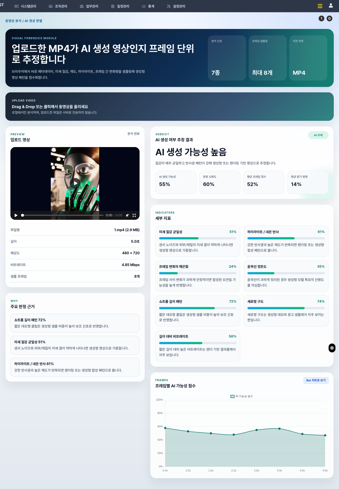

## 저장소 아키텍처

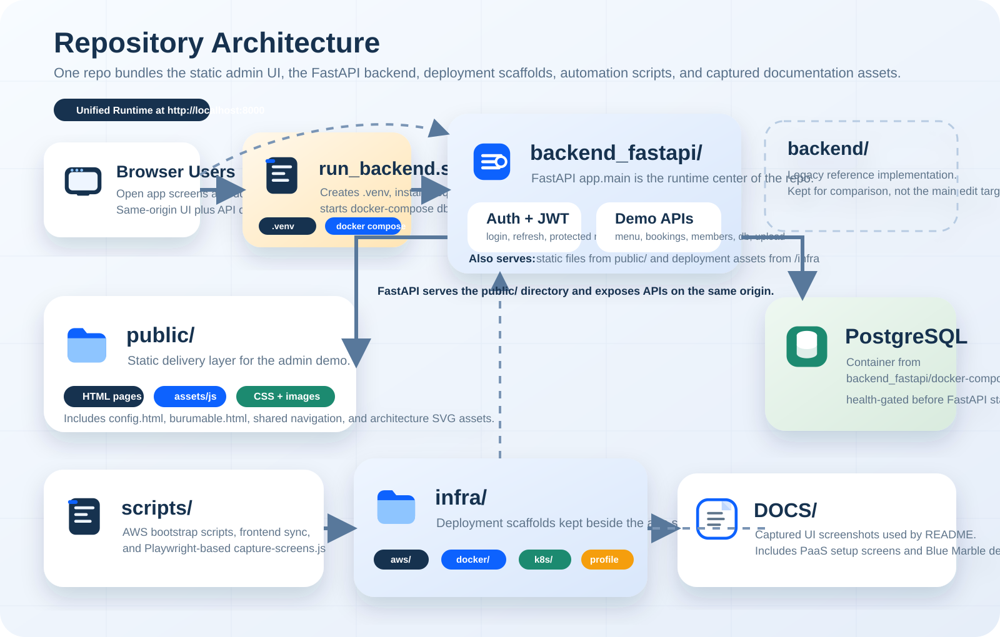

핵심 구성:

- `run_backend.sh`: `.venv` 생성, 의존성 설치, `backend_fastapi/docker-compose.yml` 의 PostgreSQL 기동, readiness 확인 후 Uvicorn 실행
- `backend_fastapi/`: 로그인/JWT, 데모 API, SQLAlchemy 모델, `public/` 및 `/infra` 파일 서빙
- `public/`: HTML 화면, 공통 메뉴, JS/CSS 자산, SVG 아키텍처 이미지
- `infra/`: AWS 서버리스, 온프레미스 Docker Compose, 온프레미스 Kubernetes 배포 스캐폴드
- `scripts/`: AWS 부트스트랩 스크립트와 `capture-screens.js` 기반 화면 캡처 자동화
- `DOCS/`: README 에서 사용하는 화면 캡처 이미지 모음

실행 흐름:

1. `run_backend.sh` 가 루트 `.venv` 를 준비하고 FastAPI 의존성을 설치합니다.
2. 같은 스크립트가 `backend_fastapi/docker-compose.yml` 로 PostgreSQL 컨테이너를 먼저 띄웁니다.
3. DB readiness 확인이 끝나면 FastAPI가 `http://localhost:8000` 에서 실행됩니다.
4. 브라우저는 같은 오리진에서 정적 화면과 API를 함께 사용합니다.

## 주요 환경 변수

- `DATABASE_URL`
- `APP_ENV`
- `CORS_ALLOW_ORIGINS`
- `JWT_SECRET_KEY`
- `ACCESS_TOKEN_TTL_MINUTES`
- `REFRESH_TOKEN_TTL_MINUTES`
- `DEMO_AUTH_ENABLED`
- `DEMO_USERS_JSON`

샘플 값: [backend_fastapi/.env.example](./backend_fastapi/.env.example)

## API 와 화면 매핑

화면별 호출 API와 구현 여부는 [docs/api-mapping.md](./docs/api-mapping.md) 에 정리되어 있습니다.

## PaaS 설치 콘솔

- 설치 화면: `http://localhost:8000/config.html`
- 1차 선택: `AWS Cloud` 또는 `On Prem`
- 2차 선택: `On Prem` 선택 시 `Docker Compose` 또는 `Kubernetes`
- 선택 결과는 브라우저에 저장되며, 설정 JSON 다운로드와 스캐폴드 미리보기를 바로 제공합니다.

관련 스캐폴드:

- 공통 프로파일: [infra/setup.profile.example.json](./infra/setup.profile.example.json)
- AWS 서버리스: [infra/aws/README.md](./infra/aws/README.md)
- Docker 온프레미스: [infra/docker/README.md](./infra/docker/README.md)
- Kubernetes 온프레미스: [infra/k8s/README.md](./infra/k8s/README.md)

실행 중에는 `/infra/...` 경로로 브라우저에서 각 파일을 직접 열 수 있습니다.

## 배포 아키텍처

### AWS Cloud / Serverless + Steering

CloudFront + S3 로 정적 파일을 전달하고, API Gateway + Lambda 로 FastAPI 런타임을 노출하는 구성입니다. 필요 시 별도 EKS steering plane 을 붙일 수 있습니다.

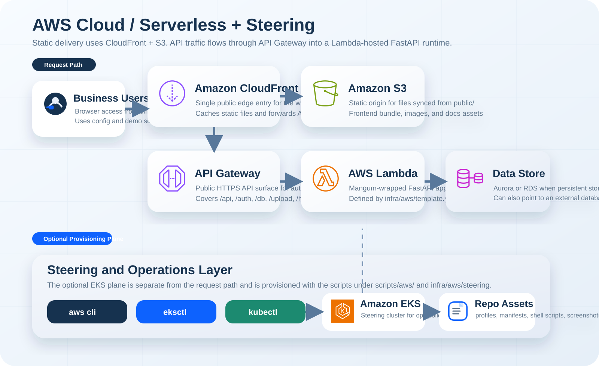

### On Prem / Docker Compose

사내 단일 서버 또는 소규모 VM 기준으로 `nginx`, `backend_fastapi`, `postgres` 를 한 호스트에서 묶어 올리는 구성입니다.

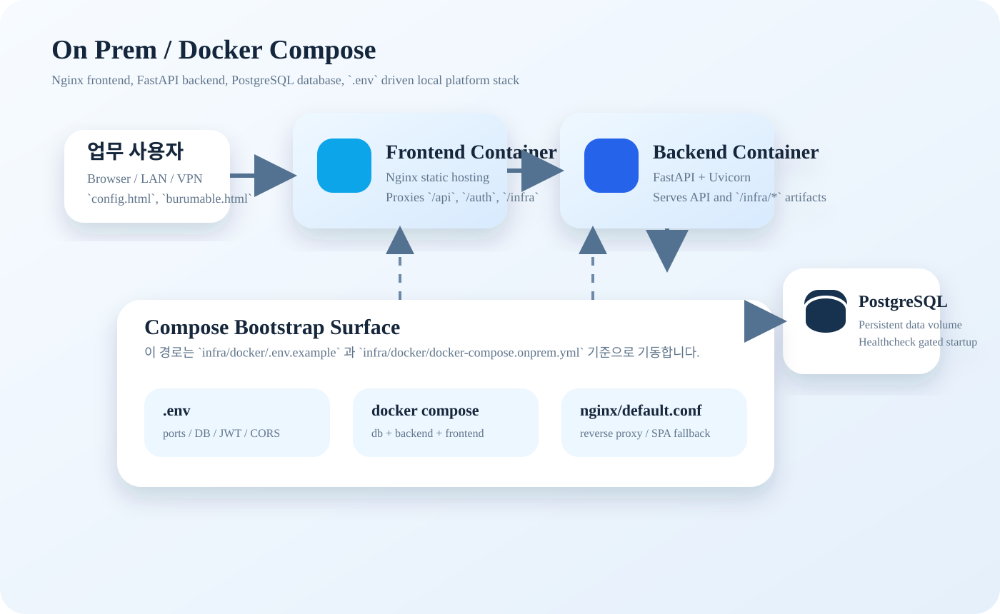

### On Prem / Kubernetes

사내 Kubernetes 클러스터 기준으로 Ingress, frontend/backend Deployment, PostgreSQL StatefulSet 으로 나눈 구성입니다.

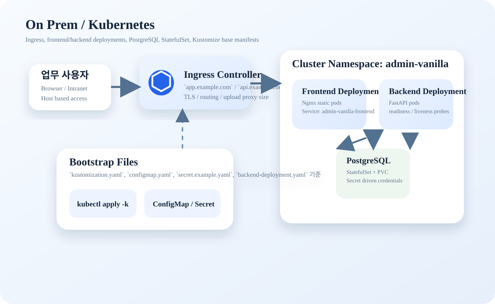

## AWS 환경 분석

리포지토리의 실제 코드와 스크립트를 기준으로 보면 AWS 배포 시 역할 분담은 아래처럼 해석됩니다.

| 저장소 자산 | AWS 대상 리소스 | 실제 역할 |
| --- | --- | --- |
| `public/` | S3 + CloudFront | HTML, CSS, JS, 이미지 등 정적 프론트 산출물 |
| `backend_fastapi/app/` | Lambda | FastAPI 앱 본체. `Mangum` 으로 Lambda 핸들러에 연결 |
| `infra/aws/template.yaml` | SAM / CloudFormation | `HttpApi`, `Lambda`, `S3`, `CloudFront`, `OAC`, Bucket Policy 정의 |
| `infra/aws/Makefile` | SAM Build Step | `backend_fastapi/app`, `public`, `infra`, `lambda_handler.py` 를 Lambda 아티팩트로 조립 |
| `scripts/aws/01~03-*.sh` | Bootstrap / Deploy / Sync | 아티팩트 버킷 생성, 스택 배포, 프론트 동기화, invalidation 실행 |
| `infra/aws/steering/*` + `scripts/aws/11~12-*.sh` | Optional EKS Steering Plane | 운영 보조용 EKS 클러스터와 읽기 전용 add-on 부트스트랩 |

운영 체크포인트:

- `infra/aws/template.yaml` 의 `DatabaseUrl` 기본값은 `sqlite:////tmp/admin-vanilla.db` 입니다. Lambda 재기동이나 scale-out 상황에서는 영속 저장소가 아니므로 운영용 DB로 교체해야 합니다.
- `backend_fastapi/app/demo_store.py` 의 일정, 용어, 재고 일부 데이터는 메모리 기반 mock 저장소입니다. cold start 이후 상태가 초기화될 수 있습니다.
- `public/assets/js` 안에는 여전히 상대 경로 `fetch('/api/...')` 호출이 남아 있습니다. 정적 프론트와 API 도메인을 분리하면 `APP_API_BASE` 주입 또는 CloudFront behavior(`/api/*` -> API Gateway) 구성이 필요합니다.
- optional steering plane 은 사용자 요청을 직접 처리하는 본 서비스 경로가 아니라, 별도 EKS 운영 보조 plane 으로 분리되어 있습니다.

## 환경 분리 전략

리포지토리 기준 권장 환경 분리는 아래와 같습니다.

| 환경 | 주 용도 | 배포 방식 | 진입점 | 주요 스크립트 |
| --- | --- | --- | --- | --- |
| `local` | 개인 개발, 기능 확인 | 로컬 Python + Docker PostgreSQL | `http://localhost:8000` | `./scripts/cicd/ci.sh local`, `./scripts/cicd/deploy.sh local` |
| `dev` | 팀 개발 통합, 기능 리뷰 | Kubernetes overlay | `dev.app.example.com`, `dev-api.example.com` | `./scripts/cicd/ci.sh dev`, `./scripts/cicd/deploy.sh dev` |
| `stage` | 배포 검증, 운영 전 리허설 | AWS Serverless | `stage.app.example.com` | `./scripts/cicd/ci.sh stage`, `./scripts/cicd/deploy.sh stage` |
| `prod` | 실제 서비스 | AWS Serverless + optional steering EKS | `app.example.com` | `./scripts/cicd/ci.sh prod`, `./scripts/cicd/deploy.sh prod` |

환경별 설정 파일:

- `local`: [scripts/cicd/env/local.sh](./scripts/cicd/env/local.sh)
- `dev`: [scripts/cicd/env/dev.sh](./scripts/cicd/env/dev.sh)
- `stage`: [scripts/cicd/env/stage.sh](./scripts/cicd/env/stage.sh)
- `prod`: [scripts/cicd/env/prod.sh](./scripts/cicd/env/prod.sh)

## local / dev / stage / prod 구성 구분

### 1. Local

- 목적: 프론트와 FastAPI를 빠르게 수정하고 API 동작을 바로 확인
- 런타임: `./run_backend.sh` 로 Uvicorn 실행, PostgreSQL 은 `backend_fastapi/docker-compose.yml` 사용
- 특징: 가장 빠른 피드백 루프, 클라우드 의존성 없음

### 2. Dev Kubernetes

- 목적: 팀 단위 통합 개발, ingress 와 service 분리 검증
- 런타임: Kubernetes base 위에 dev overlay 적용
- 주요 파일:
  - [infra/k8s/base/kustomization.yaml](./infra/k8s/base/kustomization.yaml)
  - [infra/k8s/overlays/dev/kustomization.yaml](./infra/k8s/overlays/dev/kustomization.yaml)
  - [infra/k8s/overlays/dev/patch-ingress.yaml](./infra/k8s/overlays/dev/patch-ingress.yaml)
- dev overlay 기준값:
  - namespace: `admin-vanilla-dev`
  - backend/frontend replica: `1`
  - ingress host: `dev.app.example.com`, `dev-api.example.com`
  - config: `APP_ENV=development`, dev secret placeholder, PostgreSQL PVC `5Gi`

### 3. Stage Serverless

- 목적: 운영 직전 배포 검증, CloudFront/S3/API Gateway/Lambda 경로 점검
- 런타임: `S3 + CloudFront + API Gateway + Lambda`
- 기본 설정: [scripts/cicd/env/stage.sh](./scripts/cicd/env/stage.sh)
- stage 기본값:
  - `STAGE_NAME=stage`
  - `STACK_NAME=admin-vanilla-stage-platform`
  - `FRONTEND_BUCKET=admin-vanilla-frontend-stage`
  - `ENABLE_STEERING_EKS=false`

### 4. Prod Serverless

- 목적: 실제 서비스 운영
- 런타임: `S3 + CloudFront + API Gateway + Lambda + optional steering EKS`
- 기본 설정: [scripts/cicd/env/prod.sh](./scripts/cicd/env/prod.sh)
- prod 기본값:
  - `STAGE_NAME=prod`
  - `STACK_NAME=admin-vanilla-prod-platform`
  - `FRONTEND_BUCKET=admin-vanilla-frontend-prod`
  - `ENABLE_STEERING_EKS=true`

## K8s / EKS / API Gateway / Lambda 역할 구분

| 구성 요소 | 적용 환경 | 역할 |
| --- | --- | --- |
| On-prem/Dev `Kubernetes` | `dev` | frontend/backend/postgres 를 하나의 개발용 클러스터에서 통합 검증 |
| `EKS steering cluster` | `stage`, `prod` optional | 운영 관찰/보조 plane. 사용자 트래픽 직접 처리 경로는 아님 |
| `API Gateway` | `stage`, `prod` | `/api`, `/db`, `/auth`, `/upload`, `/health`, `/infra` 요청의 public entrypoint |
| `Lambda` | `stage`, `prod` | `backend_fastapi/app` 의 FastAPI 런타임을 `Mangum` 으로 실행 |

## CI/CD Shell 구성

추가된 shell entrypoint:

- 공통 로더: [scripts/cicd/lib/common.sh](./scripts/cicd/lib/common.sh)
- CI 검증: [scripts/cicd/ci.sh](./scripts/cicd/ci.sh)
- 환경별 배포: [scripts/cicd/deploy.sh](./scripts/cicd/deploy.sh)
- 전체 파이프라인: [scripts/cicd/pipeline.sh](./scripts/cicd/pipeline.sh)

동작 기준:

- `ci.sh local`
  - Python 소스 compile 확인
  - backend/local docker compose 설정 검증
- `ci.sh dev`
  - `kubectl kustomize infra/k8s/overlays/dev` 검증
- `ci.sh stage|prod`
  - `sam build --template-file infra/aws/template.yaml`
- `deploy.sh local`
  - `run_backend.sh` 로 로컬 실행
- `deploy.sh dev`
  - `kubectl apply -k infra/k8s/overlays/dev`
  - backend/frontend rollout status 확인
- `deploy.sh stage|prod`
  - `scripts/aws/01` foundation bootstrap
  - `scripts/aws/02` SAM deploy
  - `scripts/aws/03` frontend sync + invalidation
  - prod 또는 활성화 시 steering EKS bootstrap

실행 예시:

```bash
# local
./scripts/cicd/ci.sh local
./scripts/cicd/deploy.sh local

# dev k8s
./scripts/cicd/ci.sh dev
./scripts/cicd/deploy.sh dev

# stage aws
./scripts/cicd/pipeline.sh stage

# prod aws
./scripts/cicd/pipeline.sh prod
```

## AWS 콘솔 레퍼런스 이미지

2026-03-12 기준으로 AWS 공식 문서, AWS 블로그, AWS 샘플 워크숍에서 현재 구성과 유사한 콘솔 이미지를 찾아 `DOCS/aws-console/` 아래에 저장했습니다. 실제 AWS 콘솔 UI 는 시점에 따라 달라질 수 있으므로, 아래 이미지는 README 보조 자료로 사용하면 됩니다.

<p align="center">
  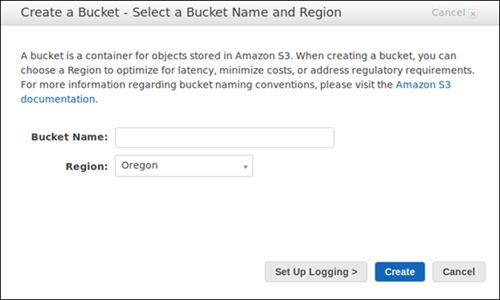
  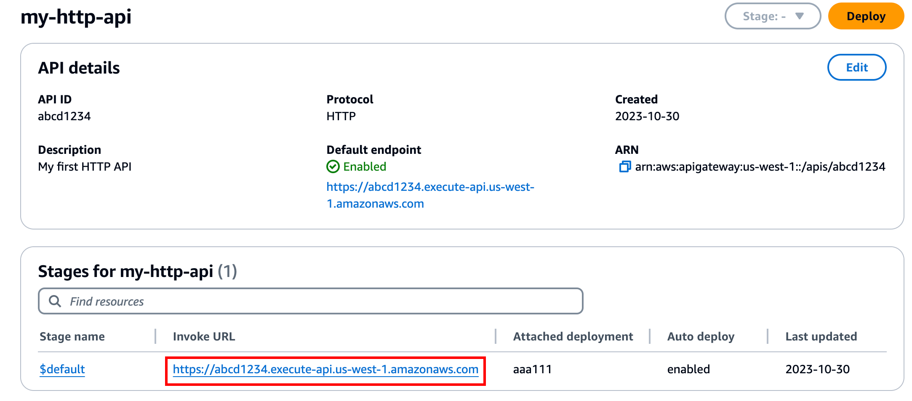
</p>
<p align="center">
  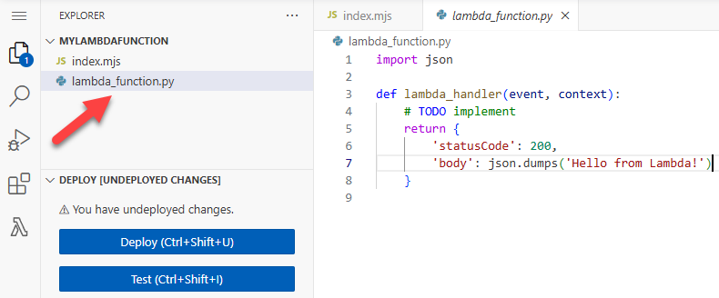
  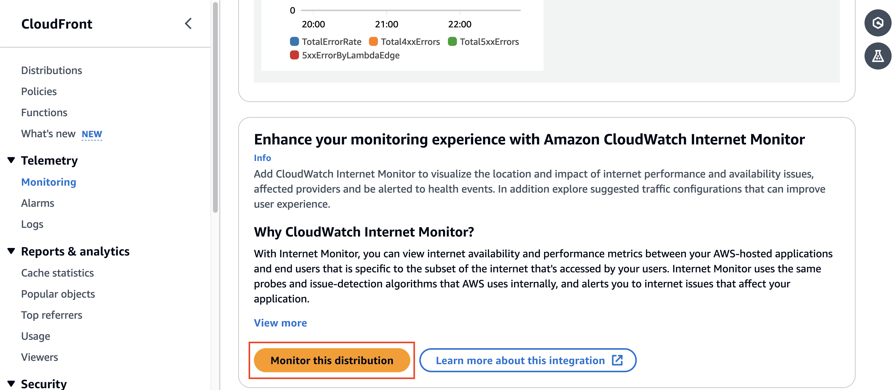
</p>
<p align="center">
  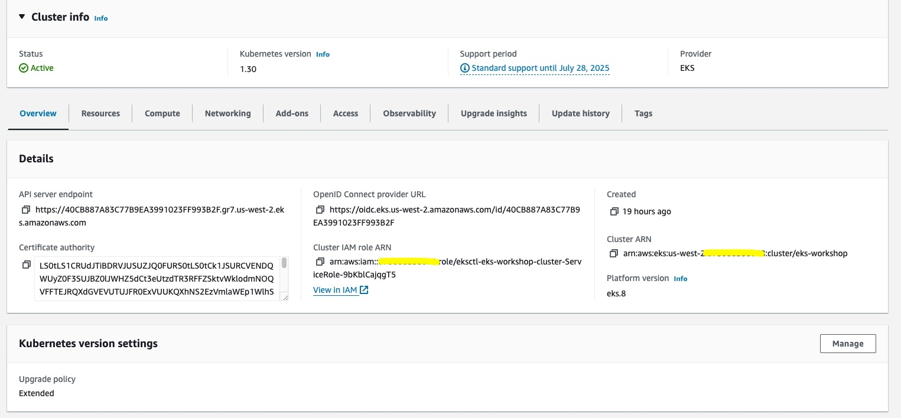
</p>

참고 출처:

- S3: [AWS Quick Starts - S3 create bucket image](https://docs.aws.amazon.com/images/quickstarts/latest/s3backup/images/s3-create-bucket.png)
- API Gateway: [AWS Developer Guide - Get started with API Gateway](https://docs.aws.amazon.com/apigateway/latest/developerguide/getting-started.html)
- Lambda: [AWS Lambda Developer Guide - Create your first Lambda function](https://docs.aws.amazon.com/lambda/latest/dg/getting-started.html)
- CloudFront: [AWS Blog image - CloudFront monitoring console](https://d2908q01vomqb2.cloudfront.net/5b384ce32d8cdef02bc3a139d4cac0a22bb029e8/2024/05/01/Screenshot-3.png)
- EKS: [EKS Workshop - View EKS console](https://www.eksworkshop.com/docs/observability/resource-view/)

## Mermaid 다이어그램

### AWS 서버리스 배포 플로우

`scripts/aws/01-bootstrap-serverless-foundation.sh` -> `02-deploy-serverless-stack.sh` -> `03-sync-frontend.sh` 순서를 기준으로 정리한 흐름입니다.

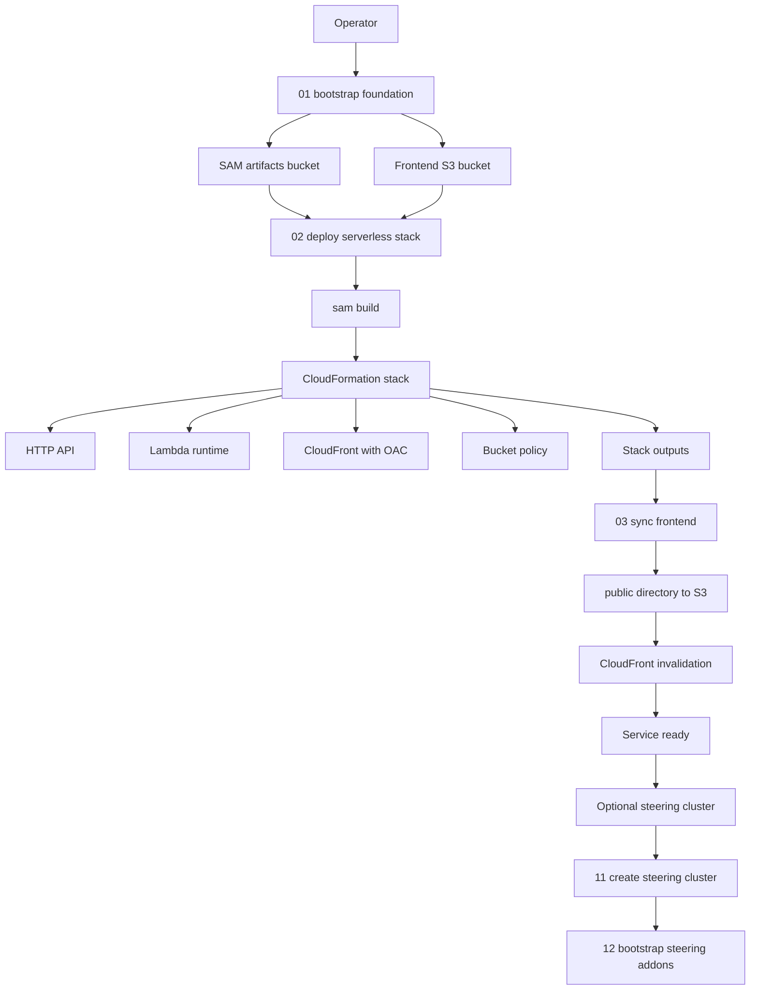
```mermaid
flowchart TD
    A[Operator] --> B[01 bootstrap foundation]
    B --> C[SAM artifacts bucket]
    B --> D[Frontend S3 bucket]
    C --> E[02 deploy serverless stack]
    D --> E
    E --> F[sam build]
    F --> G[CloudFormation stack]
    G --> H[HTTP API]
    G --> I[Lambda runtime]
    G --> J[CloudFront with OAC]
    G --> K[Bucket policy]
    G --> L[Stack outputs]
    L --> M[03 sync frontend]
    M --> N[public directory to S3]
    N --> O[CloudFront invalidation]
    O --> P[Service ready]
    P --> Q[Optional steering cluster]
    Q --> R[11 create steering cluster]
    R --> S[12 bootstrap steering addons]
```

### 환경별 CI/CD 플로우

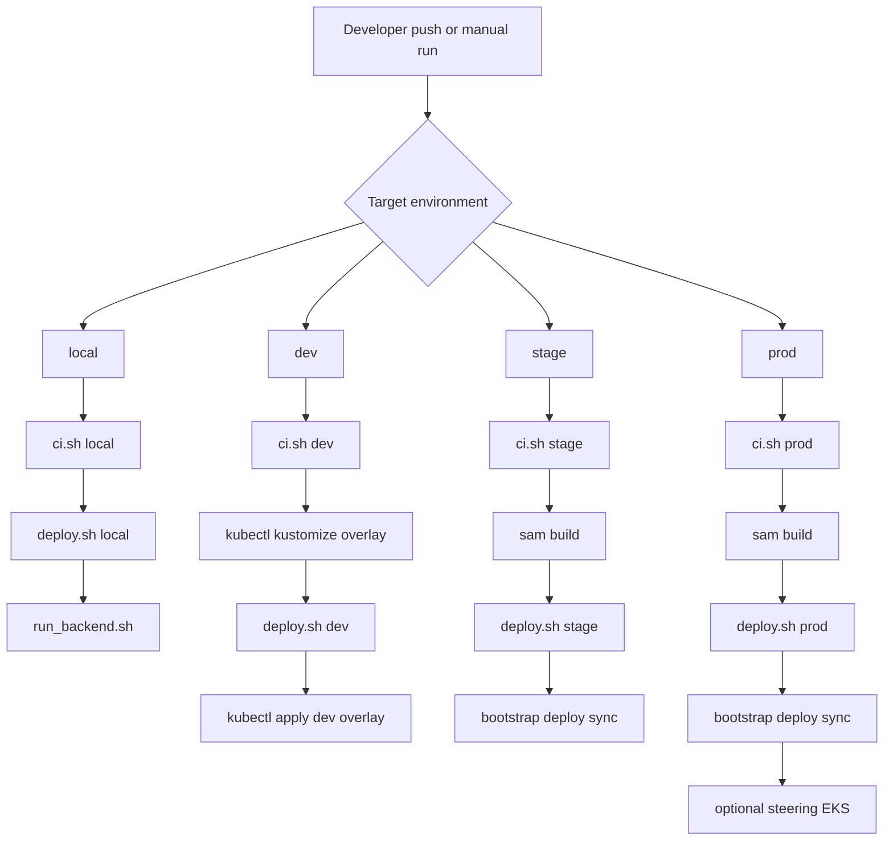
```mermaid
flowchart TD
    A[Developer push or manual run] --> B{Target environment}
    B --> C[local]
    B --> D[dev]
    B --> E[stage]
    B --> F[prod]
    C --> C1[ci.sh local]
    C1 --> C2[deploy.sh local]
    C2 --> C3[run_backend.sh]
    D --> D1[ci.sh dev]
    D1 --> D2[kubectl kustomize overlay]
    D2 --> D3[deploy.sh dev]
    D3 --> D4[kubectl apply dev overlay]
    E --> E1[ci.sh stage]
    E1 --> E2[sam build]
    E2 --> E3[deploy.sh stage]
    E3 --> E4[bootstrap deploy sync]
    F --> F1[ci.sh prod]
    F1 --> F2[sam build]
    F2 --> F3[deploy.sh prod]
    F3 --> F4[bootstrap deploy sync]
    F4 --> F5[optional steering EKS]
```

### AWS 런타임 요청 시퀀스

정적 프론트는 S3 + CloudFront, API 는 API Gateway + Lambda 로 분리되는 현재 스캐폴드의 런타임 기준입니다.

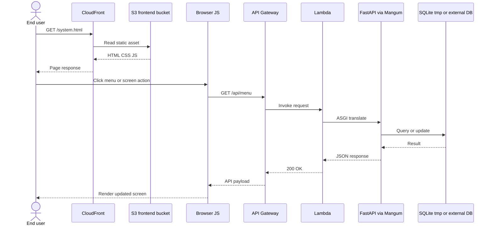
```mermaid
sequenceDiagram
    actor User as End user
    participant CF as CloudFront
    participant S3 as S3 frontend bucket
    participant JS as Browser JS
    participant APIGW as API Gateway
    participant Lambda as Lambda
    participant App as FastAPI via Mangum
    participant DB as SQLite tmp or external DB

    User->>CF: GET /system.html
    CF->>S3: Read static asset
    S3-->>CF: HTML CSS JS
    CF-->>User: Page response
    User->>JS: Click menu or screen action
    JS->>APIGW: GET /api/menu
    APIGW->>Lambda: Invoke request
    Lambda->>App: ASGI translate
    App->>DB: Query or update
    DB-->>App: Result
    App-->>Lambda: JSON response
    Lambda-->>APIGW: 200 OK
    APIGW-->>JS: API payload
    JS-->>User: Render updated screen
```

주의:

- 현재 여러 화면이 same-origin 상대 경로를 사용하므로, AWS 운영에서는 `window.APP_API_BASE` 주입 또는 CloudFront path routing 을 함께 설계해야 합니다.

### 업무 추가 플로우

`public/calendar.html` + `public/assets/js/calendar.js` + `backend_fastapi/app/main.py` 기준으로 업무 일정을 추가하는 흐름입니다.

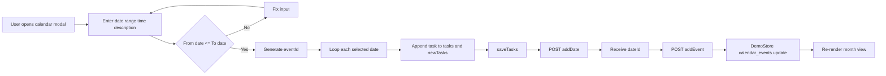
```mermaid
flowchart LR
    A[User opens calendar modal] --> B[Enter date range time description]
    B --> C{From date <= To date}
    C -- No --> D[Fix input]
    D --> B
    C -- Yes --> E[Generate eventId]
    E --> F[Loop each selected date]
    F --> G[Append task to tasks and newTasks]
    G --> H[saveTasks]
    H --> I[POST addDate]
    I --> J[Receive dateId]
    J --> K[POST addEvent]
    K --> L[DemoStore calendar_events update]
    L --> M[Re-render month view]
```

### 업무 추가 시퀀스 다이어그램

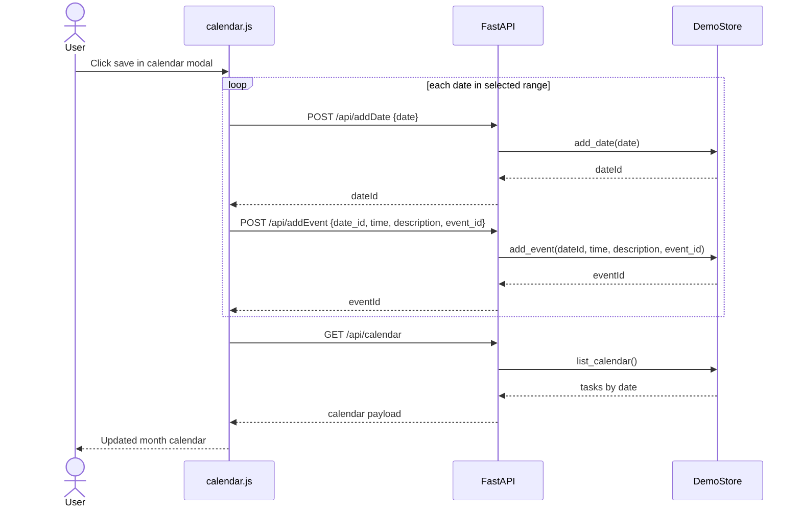
```mermaid
sequenceDiagram
    actor User
    participant UI as calendar.js
    participant API as FastAPI
    participant Store as DemoStore

    User->>UI: Click save in calendar modal
    loop each date in selected range
        UI->>API: POST /api/addDate {date}
        API->>Store: add_date(date)
        Store-->>API: dateId
        API-->>UI: dateId
        UI->>API: POST /api/addEvent {date_id, time, description, event_id}
        API->>Store: add_event(dateId, time, description, event_id)
        Store-->>API: eventId
        API-->>UI: eventId
    end
    UI->>API: GET /api/calendar
    API->>Store: list_calendar()
    Store-->>API: tasks by date
    API-->>UI: calendar payload
    UI-->>User: Updated month calendar
```

## DOCS 화면 갤러리

아래 이미지는 모두 `DOCS/` 원본을 README 에 그대로 붙인 것입니다. 화면 성격이 비슷한 것끼리 묶어서 설명을 추가했습니다.

### 1. 진입 화면과 공통 네비게이션

#### 로그인 화면 `public/index.html`

Admin, Manager, Guest 탭을 가진 기본 로그인 진입 화면입니다. 현재 데모 인증 흐름의 시작점입니다.


#### 코드관리 기본 화면 `public/system.html`

코드 그룹과 코드명을 테이블로 관리하는 대표 CRUD 화면입니다. 검색, 페이징, 저장 버튼 구성을 보여줍니다.


#### 다국어 전환 예시

같은 코드관리 화면을 일본어 라벨 기준으로 노출한 캡처입니다. 우하단 언어 선택 팝업까지 함께 보입니다.

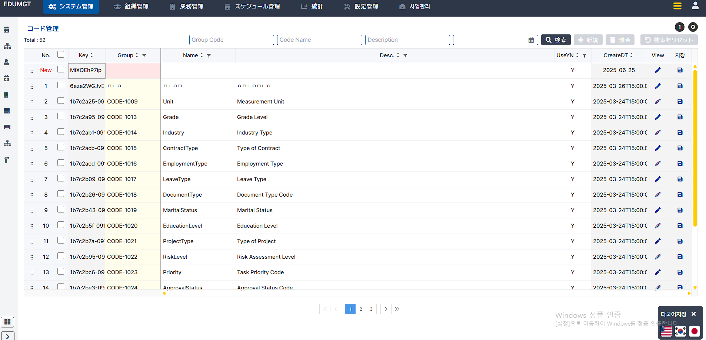

#### 전체 메뉴 오버레이

상단 메뉴에서 진입 가능한 전체 기능 목록을 한 번에 보여주는 오버레이입니다. 화면별 HTML 엔트리와 메뉴 체계를 확인할 수 있습니다.

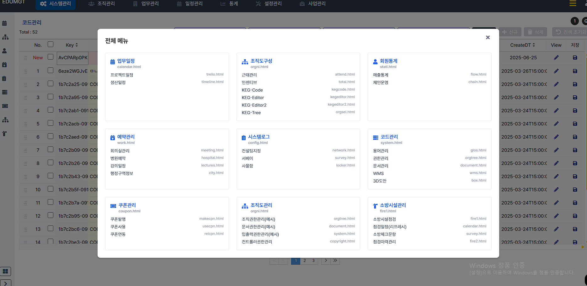

#### 좌측 트리 메뉴 전개 상태

좌측 LNB가 펼쳐진 상태의 코드관리 화면입니다. 공통 메뉴 모듈이 어떤 계층 구조로 화면을 묶는지 확인할 수 있습니다.

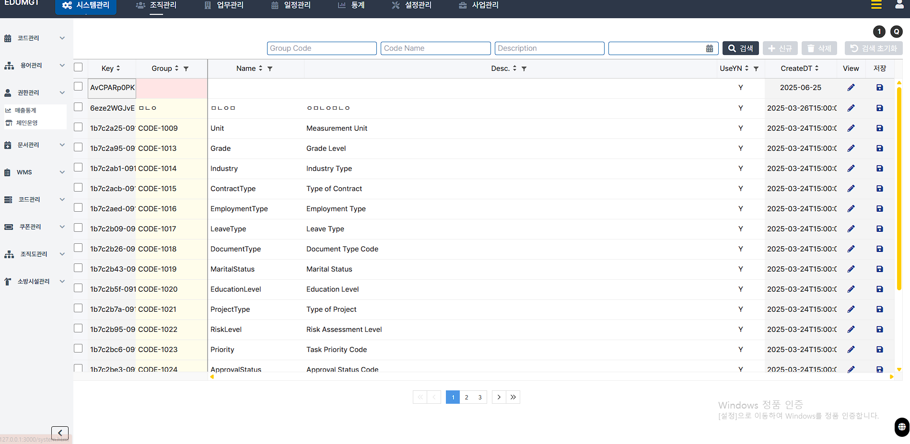

### 2. 조직, 일정, 운영 화면

#### 일정 상세 팝업 `public/calendar.html`

월간 일정 캘린더에서 특정 날짜의 업무를 수정하는 팝업 예시입니다. 날짜, 시간, 메모 입력 UI를 보여줍니다.

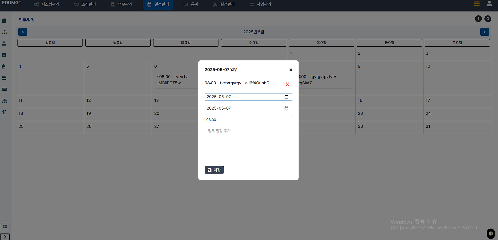

#### 조직도 구성 `public/orgni.html`

드래그 가능한 카드형 조직도 화면입니다. 부서/팀 계층과 연결선을 시각적으로 조정하는 흐름을 보여줍니다.


#### 컨설팅 지정 `public/network.html`

고객 상담 내용을 입력하고 프로세스 상태를 Pending, Success, Fail, Risk 로 분류하는 운영 화면입니다.


#### 프로젝트 일정 `public/trello.html`

업무 리스트와 간트 타임라인을 좌우로 배치한 프로젝트 일정 화면입니다. 좌측 등록, 우측 일정 시각화 구조가 한 번에 보입니다.


#### 행정구역 비교 `public/city.html`

행정구역 데이터를 표로 조회하고, 두 지역의 상세 정보와 거리/교통 정보를 비교하는 화면입니다.


#### 근태관리 `public/attend.html`

부서, 직원, 월 기준으로 출퇴근 기록을 가로 캘린더 형태로 보는 근태 관리 화면입니다.

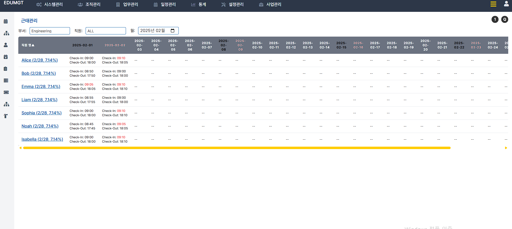

### 3. 관리 도구와 업무 편집 화면

#### 권한관리 `public/orgtree.html`

좌측 조직 트리에서 부서를 선택하고 우측에서 기능별 권한 체크박스를 설정하는 화면입니다.

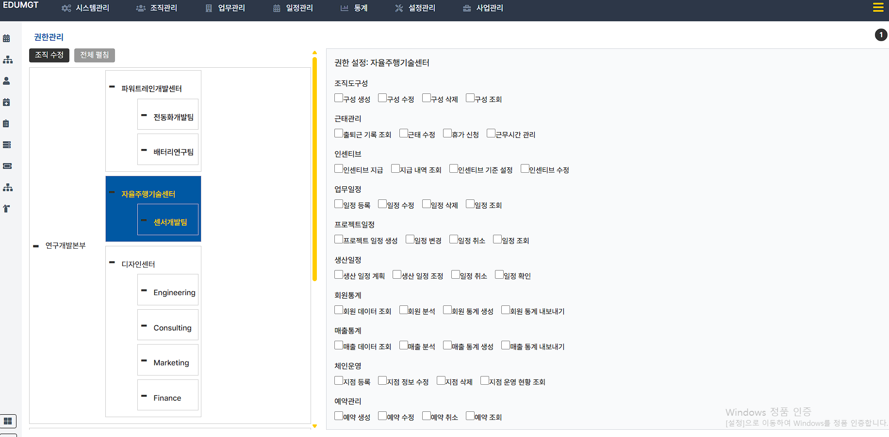

#### 설문지 구성 `public/survey.html`

설문 문항 목록을 왼쪽에서 고르고, 오른쪽에서 설문 제목과 문항 배치를 구성하는 빌더 화면입니다.


#### 설문 응답 결과 `public/survey.html`

응답 결과를 차트로 시각화하고, 우측 패널에서 추천 카드까지 함께 보여주는 결과 화면입니다.

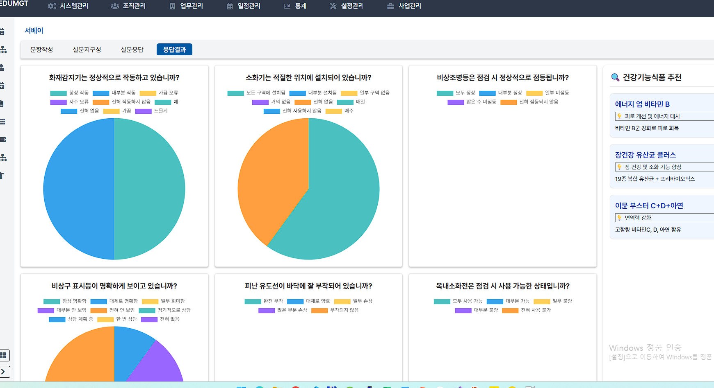

#### KEG-EDITOR `public/kegeditor.html`

좌우 AG Grid 이동과 하단 Toast UI Editor 를 결합한 편집 화면입니다. 코드 그룹 선택과 문서 편집을 한 화면에 모았습니다.

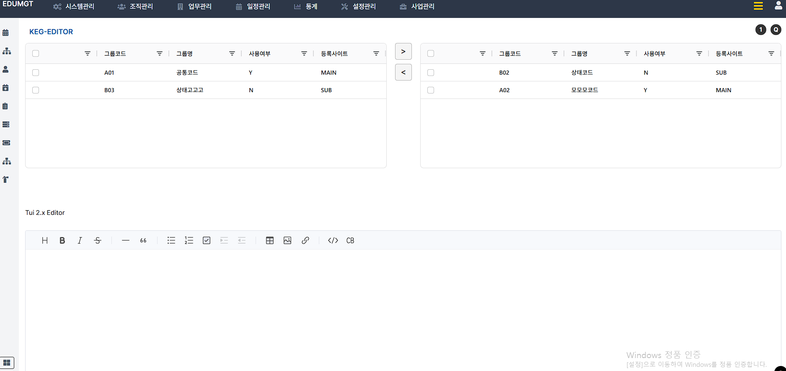

#### 사물함 관리 `public/locker.html`

사물함 카드 그리드 위에 사용자 배정 모달이 열린 상태입니다. 사물함 상태와 사용자 매핑 흐름을 확인할 수 있습니다.

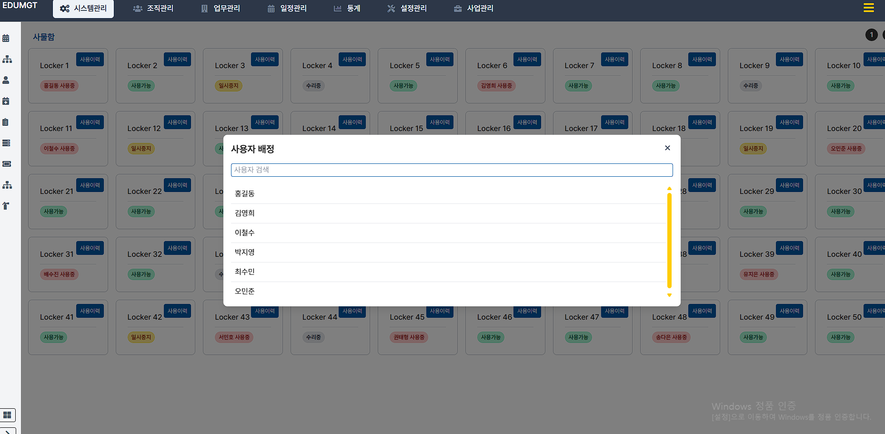

#### 3D 박스 도안 `public/box.html`

박스 크기와 색상을 조절하고 전개도를 동시에 확인하는 패키지 설계형 화면입니다.

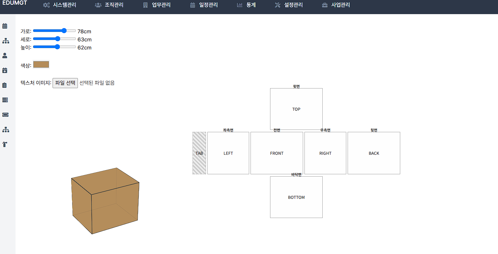

#### 블루마블 3D 화면 `public/burumable.html`

3D 보드, 우측 상태 패널, 글로우 배경을 함께 사용하는 데모 게임 화면입니다.


### 4. 대시보드와 설치 흐름

#### 시스템 로그 시각화 데모

CPU, Memory, Disk, Network 추이를 24시간 차트로 보여주는 운영 대시보드 스타일의 화면입니다.

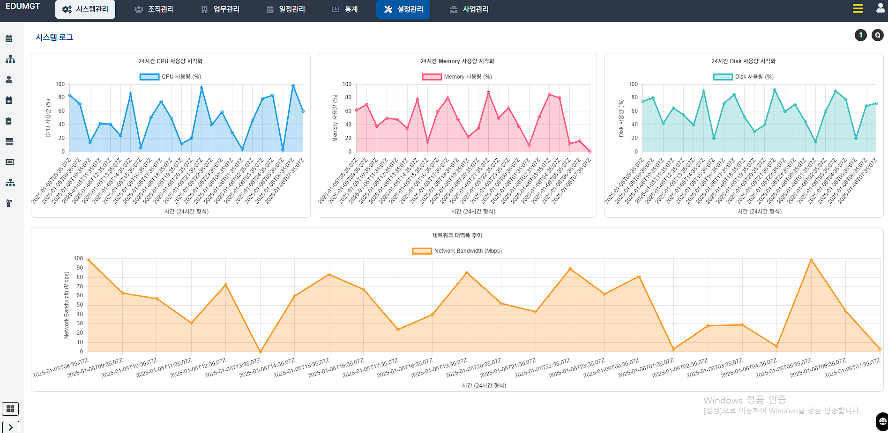

#### 대시보드형 통계 화면

막대 차트, 파이 차트, 라인 차트를 한 화면에 배치한 분석형 대시보드 예시입니다.

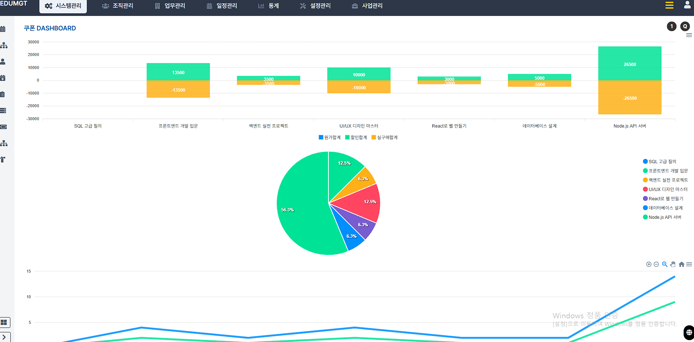

#### PaaS Setup / AWS Cloud `public/config.html`

AWS Cloud 선택 시 아키텍처, 부트스트랩 순서, 설치 항목, 생성 JSON 을 한 화면에서 보여주는 설치 콘솔 캡처입니다.

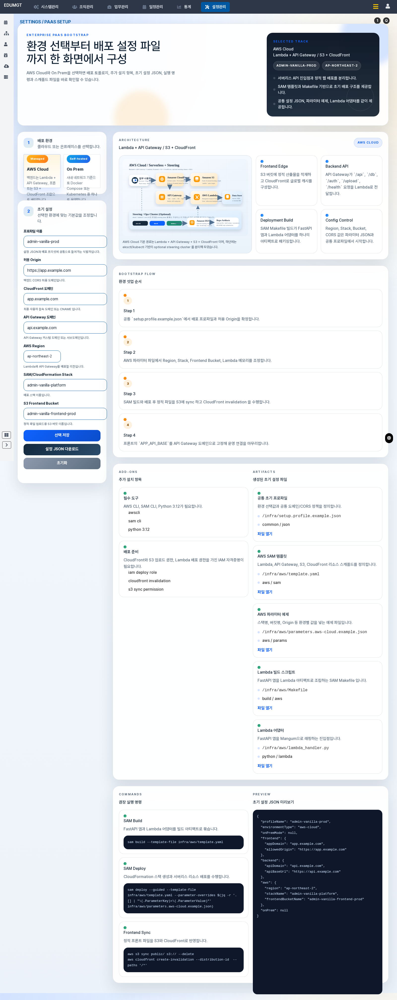

#### PaaS Setup / On Prem Kubernetes `public/config.html`

On Prem Kubernetes 선택 시 ingress, namespace, replicas, 초기 매니페스트 목록까지 함께 보여주는 설치 콘솔 캡처입니다.

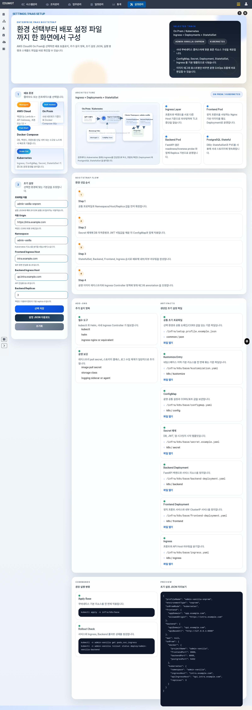

화면 캡처 자동화 스크립트: [scripts/capture-screens.js](./scripts/capture-screens.js)

```bash
docker run --rm --network host -v "$PWD":/work -w /work \
  mcr.microsoft.com/playwright:v1.58.2-jammy \
  sh -lc "mkdir -p /tmp/pw && cd /tmp/pw && npm init -y >/dev/null 2>&1 && npm install playwright-core@1.58.2 >/dev/null 2>&1 && PLAYWRIGHT_BROWSERS_PATH=/ms-playwright NODE_PATH=/tmp/pw/node_modules node /work/scripts/capture-screens.js"
```

## AWS Cloud 순차 실행

### 1. Foundation Bootstrap

배포용 S3 버킷과 프론트 버킷을 준비합니다.

```bash
chmod +x scripts/aws/01-bootstrap-serverless-foundation.sh
./scripts/aws/01-bootstrap-serverless-foundation.sh
```

스크립트: [scripts/aws/01-bootstrap-serverless-foundation.sh](./scripts/aws/01-bootstrap-serverless-foundation.sh)

### 2. Serverless Stack Deploy

SAM + AWS CLI 로 Lambda, API Gateway, S3, CloudFront 스택을 배포합니다.

```bash
chmod +x scripts/aws/02-deploy-serverless-stack.sh
./scripts/aws/02-deploy-serverless-stack.sh
```

스크립트: [scripts/aws/02-deploy-serverless-stack.sh](./scripts/aws/02-deploy-serverless-stack.sh)

### 3. Frontend Sync

정적 프론트를 S3 로 동기화하고 CloudFront invalidation 을 수행합니다.

```bash
chmod +x scripts/aws/03-sync-frontend.sh
./scripts/aws/03-sync-frontend.sh
```

스크립트: [scripts/aws/03-sync-frontend.sh](./scripts/aws/03-sync-frontend.sh)

### 4. Steering Cluster 생성

운영용 steering plane 이 필요하면 `aws cli + eksctl + kubectl` 조합으로 EKS 클러스터를 별도로 생성합니다.

```bash
chmod +x scripts/aws/11-create-steering-cluster.sh
./scripts/aws/11-create-steering-cluster.sh
```

스크립트: [scripts/aws/11-create-steering-cluster.sh](./scripts/aws/11-create-steering-cluster.sh)

### 5. Steering Add-ons 적용

steering namespace, configmap, read-only service account 를 적용합니다.

```bash
chmod +x scripts/aws/12-bootstrap-steering-addons.sh
./scripts/aws/12-bootstrap-steering-addons.sh
```

스크립트: [scripts/aws/12-bootstrap-steering-addons.sh](./scripts/aws/12-bootstrap-steering-addons.sh)

관련 manifest:

- [infra/aws/steering/namespace.yaml](./infra/aws/steering/namespace.yaml)
- [infra/aws/steering/configmap.yaml](./infra/aws/steering/configmap.yaml)
- [infra/aws/steering/steering-rbac.yaml](./infra/aws/steering/steering-rbac.yaml)
