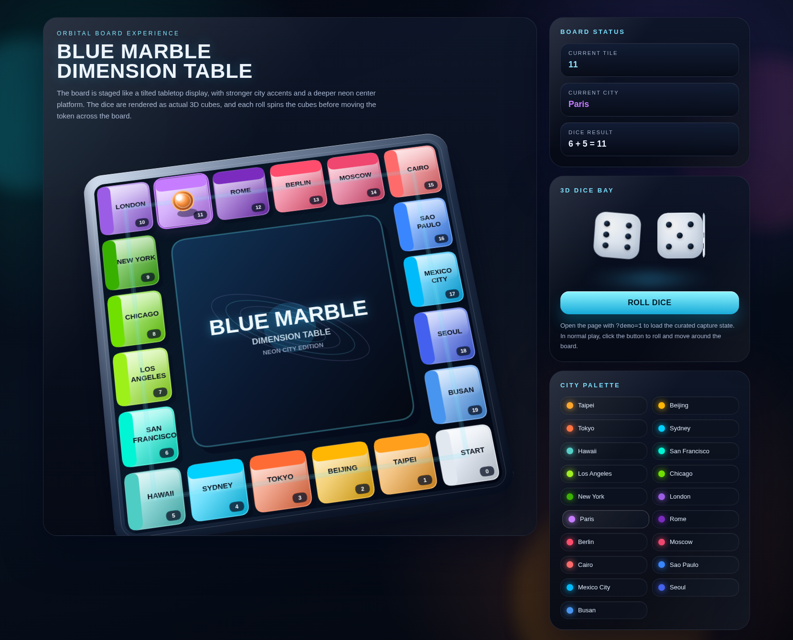

# Admin Vanilla Publishing

정적 HTML/Vanilla JS 화면과 `backend_fastapi` 기반 FastAPI 서버를 함께 사용하는 데모 저장소입니다.

## 현재 기준

- 단일 실행 기준 백엔드: `backend_fastapi`
- 기본 접속 주소: `http://localhost:8000`
- 정적 화면과 API를 같은 오리진에서 제공합니다.
- legacy 참고 구현은 `backend/` 에 남아 있지만 신규 수정 기준은 아닙니다.

## 빠른 실행

```bash
./run_backend.sh
```

실행 후 확인:

- 메인 화면: `http://localhost:8000/`
- 블루마블 데모: `http://localhost:8000/burumable.html`
- 헬스체크: `http://localhost:8000/health`
- 준비상태 체크: `http://localhost:8000/health/ready`

## 실행 구조

1. `backend_fastapi/docker-compose.yml` 로 PostgreSQL 실행
2. 루트 `.venv` 에 FastAPI 의존성 설치
3. DB 준비 완료 후 FastAPI 실행
4. FastAPI가 `public/` 정적 파일까지 직접 서빙

개발 모드와 운영 모드 분리:

```bash
# 개발 모드(default, reload on)
APP_ENV=development ./run_backend.sh

# 운영 모드(reload off)
APP_ENV=production ./run_backend.sh
```

## 주요 환경 변수

- `DATABASE_URL`
- `APP_ENV`
- `CORS_ALLOW_ORIGINS`
- `JWT_SECRET_KEY`
- `ACCESS_TOKEN_TTL_MINUTES`
- `REFRESH_TOKEN_TTL_MINUTES`
- `DEMO_AUTH_ENABLED`
- `DEMO_USERS_JSON`

샘플 값은 [backend_fastapi/.env.example](/home/Admin-Vanilla-Publishing/backend_fastapi/.env.example) 에 있습니다.

## API/화면 매핑

화면별 호출 API와 구현 여부는 [docs/api-mapping.md](/home/Admin-Vanilla-Publishing/docs/api-mapping.md) 에 정리했습니다.

## PaaS 설치 콘솔

- 설치 화면: `http://localhost:8000/config.html`
- 1차 선택: `AWS Cloud` 또는 `On Prem`
- 2차 선택: `On Prem`일 때 `Docker Compose` 또는 `Kubernetes`
- 현재 선택값은 브라우저에 저장되며, 화면에서 바로 초기 설정 JSON 다운로드가 가능합니다.

배포 스캐폴드 위치:

- 공통 프로파일: [infra/setup.profile.example.json](/home/Admin-Vanilla-Publishing/infra/setup.profile.example.json)
- AWS 서버리스: [infra/aws/README.md](/home/Admin-Vanilla-Publishing/infra/aws/README.md)
- Docker 온프레미스: [infra/docker/README.md](/home/Admin-Vanilla-Publishing/infra/docker/README.md)
- Kubernetes 온프레미스: [infra/k8s/README.md](/home/Admin-Vanilla-Publishing/infra/k8s/README.md)

실행 중에는 `/infra/...` 경로로 브라우저에서 설정 파일을 직접 열 수 있습니다.

## 아키텍처 SVG

### AWS Cloud / Serverless + Steering


### On Prem / Docker Compose


### On Prem / Kubernetes


아키텍처 SVG에서 사용하는 AWS 아이콘 자산:

- [API Gateway SVG](/home/Admin-Vanilla-Publishing/public/assets/img/aws-icons/api-gateway.svg)
- [Lambda SVG](/home/Admin-Vanilla-Publishing/public/assets/img/aws-icons/lambda.svg)
- [S3 SVG](/home/Admin-Vanilla-Publishing/public/assets/img/aws-icons/s3.svg)
- [CloudFront SVG](/home/Admin-Vanilla-Publishing/public/assets/img/aws-icons/cloudfront.svg)
- [RDS SVG](/home/Admin-Vanilla-Publishing/public/assets/img/aws-icons/rds.svg)
- [EKS SVG](/home/Admin-Vanilla-Publishing/public/assets/img/aws-icons/eks.svg)

## AWS Cloud 순차 실행

### 1. Foundation Bootstrap

AWS CLI 로 배포용 S3 버킷과 프론트 버킷을 준비합니다.

```bash
chmod +x scripts/aws/01-bootstrap-serverless-foundation.sh
./scripts/aws/01-bootstrap-serverless-foundation.sh
```

스크립트: [01-bootstrap-serverless-foundation.sh](/home/Admin-Vanilla-Publishing/scripts/aws/01-bootstrap-serverless-foundation.sh)

### 2. Serverless Stack Deploy

SAM + AWS CLI 로 Lambda, API Gateway, S3, CloudFront 스택을 배포합니다.

```bash
chmod +x scripts/aws/02-deploy-serverless-stack.sh
./scripts/aws/02-deploy-serverless-stack.sh
```

스크립트: [02-deploy-serverless-stack.sh](/home/Admin-Vanilla-Publishing/scripts/aws/02-deploy-serverless-stack.sh)

### 3. Frontend Sync

정적 프론트를 S3로 동기화하고 CloudFront invalidation 을 실행합니다.

```bash
chmod +x scripts/aws/03-sync-frontend.sh
./scripts/aws/03-sync-frontend.sh
```

스크립트: [03-sync-frontend.sh](/home/Admin-Vanilla-Publishing/scripts/aws/03-sync-frontend.sh)

### 4. Steering Cluster 생성

운영용 steering plane 이 필요하면 `aws cli + eksctl + kubectl` 조합으로 EKS 클러스터를 별도로 만듭니다.

```bash
chmod +x scripts/aws/11-create-steering-cluster.sh
./scripts/aws/11-create-steering-cluster.sh
```

스크립트: [11-create-steering-cluster.sh](/home/Admin-Vanilla-Publishing/scripts/aws/11-create-steering-cluster.sh)

### 5. Steering Add-ons 적용

steering namespace, configmap, read-only service account 를 적용합니다.

```bash
chmod +x scripts/aws/12-bootstrap-steering-addons.sh
./scripts/aws/12-bootstrap-steering-addons.sh
```

스크립트: [12-bootstrap-steering-addons.sh](/home/Admin-Vanilla-Publishing/scripts/aws/12-bootstrap-steering-addons.sh)

관련 manifest:

- [namespace.yaml](/home/Admin-Vanilla-Publishing/infra/aws/steering/namespace.yaml)
- [configmap.yaml](/home/Admin-Vanilla-Publishing/infra/aws/steering/configmap.yaml)
- [steering-rbac.yaml](/home/Admin-Vanilla-Publishing/infra/aws/steering/steering-rbac.yaml)

## 중요 화면 캡처

Playwright 컨테이너 기반 캡처 스크립트: [capture-screens.js](/home/Admin-Vanilla-Publishing/scripts/capture-screens.js)

```bash
docker run --rm --network host -v "$PWD":/work -w /work \
  mcr.microsoft.com/playwright:v1.58.2-jammy \
  sh -lc "mkdir -p /tmp/pw && cd /tmp/pw && npm init -y >/dev/null 2>&1 && npm install playwright-core@1.58.2 >/dev/null 2>&1 && PLAYWRIGHT_BROWSERS_PATH=/ms-playwright NODE_PATH=/tmp/pw/node_modules node /work/scripts/capture-screens.js"
```

### PaaS Setup / AWS Cloud


### PaaS Setup / On Prem Kubernetes


## 3D 블루마블 화면

### `public/burumable.html`



## 검증 요약 (자동 분석)

- 대상 저장소: `Admin-Vanilla-Publishing`
- 주요 실행 스크립트: `./run_backend.sh` (루트) — 존재 및 FastAPI + DB 기동 로직 포함
- Playwright 캡처 스크립트: `scripts/capture-screens.js` — 존재 (출력: `DOCS/paas-setup-aws.png`, `DOCS/paas-setup-onprem-k8s.png`, `DOCS/burumable-3d.png`)
- AWS 아키텍처 SVG: `public/assets/img/architecture/aws-serverless-architecture.svg` (AWS 아이콘 리소스는 `public/assets/img/aws-icons/`에 있음)

### todo.md 기준 상태 요약
- P0 (즉시) 항목: 완료됨 (API 매핑, 프론트 하드코딩 제거, README 정합성 정리) — 문서/스크립트로 반영되어 있음
- P1 (단기) 항목: 대부분 반영됨(예: CORS/인증 기본 구성, DB readiness, run script 분리 옵션 존재) — 추가 검토/환경 변수 점검 권장
- P2 (중기) 항목: 미완료
  - Alembic 초기 도입: 미구현
  - 통합 테스트 및 CI: 미구성
  - 관측성(구조화 로깅, 헬스 분리): 부분 구현(헬스 엔드포인트는 존재)이나 보강 필요

현재 상태로는 `./run_backend.sh`를 실행하면 로컬에서 FastAPI + PostgreSQL(도커) 구성으로 앱을 기동할 수 있으며, Playwright 스크립트로 주요 화면 캡처가 가능합니다. 다만 이 환경에서 직접 실행하거나 캡처를 수행하지는 않았습니다.

### 로컬에서 캡처 실행 (권장)
1. 로컬에서 앱 실행

   # 개발 모드 (reload 포함)
   APP_ENV=development ./run_backend.sh

2. 별도의 터미널에서 Playwright 컨테이너로 캡처 실행

   docker run --rm --network host -v "$PWD":/work -w /work \
     mcr.microsoft.com/playwright:v1.58.2-jammy \
     sh -lc "mkdir -p /tmp/pw && cd /tmp/pw && npm init -y >/dev/null 2>&1 && npm install playwright-core@1.58.2 >/dev/null 2>&1 && PLAYWRIGHT_BROWSERS_PATH=/ms-playwright NODE_PATH=/tmp/pw/node_modules node /work/scripts/capture-screens.js"

3. 생성된 스크린샷은 `DOCS/` 디렉터리에 저장됩니다.

---

(자동 분석 결과를 Readme에 추가했습니다.)
